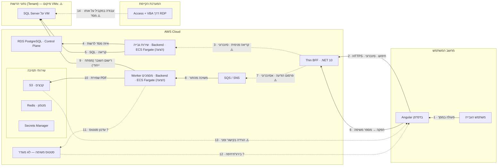

# שקף הזהב — מסמך עבודה להובלת הפיתוח עם AI

> **מקורות:** תרשים הארכיטקטורה של הארכיטקט (`slides/architecture.jpg`) וחוברת המיגרציה (`מיגרציה.xlsx`).
> **מצב הפרויקט:** אין עדיין קוד של מערכת ה־Web. כל חיבור כאן הוא **בתכנון** או **דורש אימות**; שום חיבור אינו "קיים בקוד".
> **התהליך בשקף:** "הפקת שובר לחייב" היא **דוגמה להמחשה בלבד**. היא נבחרה כי היא מכילה בקשה קצרה, פעולה ארוכה וחיבור לנתוני הרשות. התהליך האמיתי ייבחר מול בעלי המערכת (ראו שלב 2).
> **סימון:** ⚠️ = נדרש אימות מול הארכיטקט.

השקף עצמו: [`golden-slide.html`](golden-slide.html) (פותחים בדפדפן, מסך אחד) · תמונה: `slides/golden.jpg`.

---

## 1. כך פעולה באקסס הופכת לפעולה ב־Web

היום משתמש פותח טופס אקסס דרך RDP. **הטופס, הכללים העסקיים (VBA) והגישה למסד הם קובץ אחד**, שרץ על שרת Terminal ומדבר ישירות עם SQL Server.

ביעד אותה פעולה מתפרקת לשלוש אחריויות נפרדות:

1. **המסך (Angular בדפדפן):** מציג ואוסף קלט. לא מחליט שום דבר עסקי.
2. **שכבת הכניסה (Thin BFF):** מזהה מי המשתמש ומאיזו רשות, בודקת הרשאה, ומעבירה את הבקשה לשירות הנכון. גם היא לא מחליטה שום דבר עסקי.
3. **השירות העסקי (Backend Service):** כאן חיים הכללים, למשל איך מחושב סכום השובר. הוא היחיד שקורא וכותב את נתוני הרשות.

פעולה קצרה מקבלת תשובה מיד (חצים 1–5). פעולה ארוכה מקבלת **מספר משימה**, מתבצעת ברקע דרך תור, והתוצאה מגיעה אחר כך (חצים 6–13). בתקופת המעבר אקסס וה־Web עובדים על **אותו מסד** (חץ 14), ולכן חייבים להחליט מי מעדכן מה.

---

## 2. שלב 1 — פירוש הארכיטקטורה, רכיב אחר רכיב

### ההבדלים שחייבים להבין

| מושג | מה זה בפשטות | דוגמה בשקף |
|---|---|---|
| **API** | חוזה: "איזו בקשה מותר לשלוח, באילו שדות, ומה חוזר". הוא הגדרה, לא רכיב. | הבקשה בחץ 2: "חפש חייב לפי שם" ← רשימת חייבים |
| **BFF** | שרת שמקבל את בקשות ה־API מהמסך ומפנה אותן הלאה. | Thin BFF |
| **שירות עסקי** | שרת שמחזיק את הכללים העסקיים של תחום אחד ואת הגישה לנתונים שלו. | שירות גבייה, Worker מסמכים |
| **תור הודעות** | "תיבת דואר" בין רכיבים: מי ששולח לא מחכה, ומי שמקבל מטפל כשהוא פנוי. גם אם השירות נפל, ההודעה נשמרת. | SQS / SNS |
| **חיבור למסד** | השירות פותח חיבור ל־SQL Server וקורא או כותב טבלאות. רק השירות העסקי עושה זאת. | חצים 5 ו־9 |

**איפה הלוגיקה העסקית?** רק בשירותי ה־Backend. לא במסך, לא ב־BFF ולא בתור.

**מה זה "Thin BFF"?** "דק" אומר שהוא עושה רק: אימות משתמש, זיהוי Tenant, בדיקת הרשאה, ניתוב לשירות, והרכבת התשובה בצורה שהמסך צריך.
**מה אסור שייכנס אליו:** חישובים, כללי אישור, שאילתות למסד הרשות, החלטות כמו "האם מותר להפיק שובר לחייב הזה".

**איך המשתמש מקבל תוצאה של פעולה ארוכה?** ה־BFF מחזיר מיד מספר משימה, והעבודה מתבצעת ברקע. איך הסטטוס חוזר למסך **לא מוגדר בתרשים**. האפשרויות הן בירור חוזר (Polling) או דחיפה (למשל SignalR). ⚠️ זו החלטה של הארכיטקט, ולכן היא מסומנת באדום בשקף (חצים 11–12).

### הרכיבים

| רכיב | איזו בעיה פותר | מי פונה אליו | למי הוא פונה | מה עובר | לפתח או תשתית | מה ידוע / ⚠️ |
|---|---|---|---|---|---|---|
| **Angular (דפדפן)** | עבודה בלי RDP והתקנות | המשתמש | BFF | פעולות משתמש, נתוני תצוגה | **לפתח** | ידוע מהתרשים |
| **Thin BFF (.NET 10)** | נקודת כניסה אחת, מאובטחת, למסך | Angular | שירותים, תור | בקשות עם זהות ו־Tenant | **לפתח** (קוד דק) | ⚠️ שני BFF בתרשים: האם הם רכיב אחד או שניים? |
| **Thin BFF (Messaging)** | הכנסת פעולות ארוכות לתור | לפי התרשים: API Calls | SQS/SNS | הודעת משימה | **לפתח** | ⚠️ ייתכן שזה אותו BFF בתפקיד אחר |
| **SQS / SNS** | פעולות ארוכות לא חוסמות את המסך | BFF | שירותי Backend | הודעות משימה ואירועים | **תשתית** (הגדרה) | ⚠️ אילו פעולות עוברות בתור. לא כל קריאה עוברת בתור |
| **Backend Services (ECS Fargate)** | הכללים העסקיים, מחולקים לתחומים | BFF, תור | מסד הרשות, Control Plane, S3 | נתונים עסקיים | **לפתח** (עיקר העבודה) + תשתית הרצה | ⚠️ חלוקת השירותים ושמותיהם |
| **RDS PostgreSQL (Control Plane)** | לדעת איזו רשות, איזה מסד, אילו הרשאות | שירותים, BFF | — | הגדרות ומיפוי רשויות | **תשתית** + טבלאות הגדרה | ⚠️ מה בדיוק נשמר בו. **לא** נתונים עסקיים |
| **SQL Server על VM (Tenant)** | הנתונים העסקיים וההיסטוריה של כל רשות | שירותים, ובמעבר גם Access | — | חיובים, שוברים, תשלומים | **קיים**, ללא פיתוח בשלב זה | ⚠️ היכן ה־VMs, ואיך הענן מגיע אליהם ברשת |
| **Redis** | מהירות: עותק של נתונים שנקראים הרבה | שירותים | — | הגדרות, מטמון | **תשתית** | עותק בלבד, לא מקור אמת |
| **S3** | אחסון קבצים במקום שרת UNC | Worker, BFF | — | קובצי PDF | **תשתית** + קוד שמירה והורדה | ⚠️ קישור זמני: מי מנפיק אותו |
| **Secrets Manager** | סיסמאות מחוץ לקוד | שירותים | — | מחרוזות חיבור, מפתחות | **תשתית** | — |
| **Local Agent + SignalR/WSS** | גישה לסורק ולכרטיס חכם בלי RDP | לפי התרשים: מחובר לדפדפן | סורק, כרטיס חכם | פקודות סריקה, קבצים | **לפתח** (בגל 3) | ⚠️ אופן החיבור לא ידוע מהתרשים. **לא בתהליך הזה** |

---

## 3. שלב 2 — בחירת התהליך הראשון

אין בפרויקט קוד או מסמכי מערכת שמגדירים תהליך, ולכן השקף משתמש ב**דוגמה להמחשה**. כדי לבחור את התהליך האמיתי, יש לענות על חמש שאלות:

1. איזו פעולה אחת באקסס נרצה להעביר ראשונה, ומי עושה אותה ביום־יום?
2. מה המשתמש מזין, ומה הוא מצפה לראות או לקבל בסוף?
3. האם הפעולה רק מציגה מידע, שומרת מידע, מפיקה מסמך, או מפעילה ציוד כמו סורק?
4. איך נדע שזה הצליח? למשל: "אותו סכום ואותו מסמך כמו באקסס".
5. באיזו רשות ובאילו נתוני בדיקה מותר להשתמש בניסוי?

**המלצה לבחירה:** פעולה קטנה שקוראת מידע ומציגה אותו (רק חצים 1–5), ואחריה פעולה אחת שכותבת. כך מוכיחים את השרשרת לפני שנכנסים לתור ולמסמכים.

---

## 4. שלב 4 — טבלת החצים ומשימות הפיתוח

| # | הפעולה העסקית | מקור → יעד | מה צריך לבנות | חוזה המידע (הצעה) | איך בודקים | תלות / שאלה פתוחה |
|---|---|---|---|---|---|---|
| 1 | המשתמש מחפש חייב ולוחץ "הפק שובר" | משתמש → Angular | מסך חיפוש וכפתור (Frontend) | — | רואים את המסך, מקלידים, מקבלים תוצאות | אילו שדות חיפוש באקסס היום |
| 2 | חיפוש חייב | Angular → BFF · HTTPS · סינכרוני | קריאה מהמסך (Frontend) + נקודת קצה ב־BFF | `GET /api/payers?query=` → רשימת `{id, name}` | בדיקה מהדפדפן: מחזיר רשימה. בלי הזדהות: נדחה | ⚠️ שיטת ההזדהות (SSO? אסימון?) |
| 3 | העברה לשירות | BFF → שירות גבייה · סינכרוני | ניתוב ב־BFF + נקודת קצה בשירות | אותו חוזה + `tenantId`, `userId`, `correlationId` | לוג בשני הרכיבים עם אותו `correlationId` | ⚠️ איך BFF קורא לשירות (HTTP פנימי? אחר?) |
| 4 | לאיזה מסד שייכת הרשות | שירות → Control Plane (דרך Redis) | קוד "מצא את מסד הרשות" | `tenantId` → פרטי מסד (הסיסמה מ־Secrets Manager) | רשות לא קיימת: שגיאה ברורה, לא נתונים של רשות אחרת | ⚠️ מבנה הטבלאות ב־Control Plane |
| 5 | קריאת החייבים | שירות → SQL Server של הרשות · SQL | שאילתת קריאה בשירות | שאילתה **לקריאה בלבד** | אותם חייבים כמו באקסס, באותה רשות | אילו טבלאות ושאילתות אקסס משתמש היום |
| 6 | בקשת הפקת שובר | Angular → BFF · סינכרוני (קבלה בלבד) | כפתור + נקודת קצה שמחזירה מספר משימה | `POST /api/vouchers/jobs {payerId}` → `202 {jobId}` | לחיצה מחזירה מספר משימה מיד, גם כשהעבודה ארוכה | — |
| 7 | הכנסה לתור | BFF → SQS · אסינכרוני | פרסום הודעה | `{jobId, tenantId, payerId, requestedBy, correlationId}` | ההודעה מופיעה בתור (בסביבת בדיקה) | ⚠️ האם זה "Thin BFF (Messaging)" נפרד |
| 8 | משיכת המשימה | SQS → Worker · אסינכרוני | צרכן תור ב־Worker | אותה הודעה | עיבוד פעם אחת גם כשההודעה נמסרת פעמיים | ⚠️ מדיניות ניסיונות חוזרים ותור לכשלים |
| 9 | רישום השובר | Worker → SQL Server · SQL | כלל ההפקה + רישום | כתיבה עם **מפתח ייחודי** = `jobId` | הרצה כפולה לא יוצרת שני שוברים | ⚠️ מי מקור האמת לשוברים בתקופת המעבר (חץ 14) |
| 10 | שמירת הקובץ | Worker → S3 | יצירת PDF ושמירה | `tenant/{tenantId}/vouchers/{jobId}.pdf` (הצעה) | הקובץ זהה לשובר שאקסס מפיק | ⚠️ תבנית השובר המחייבת |
| 11 | עדכון סטטוס | Worker → ? | — | `{jobId, status, error?}` | — | 🔴 **לא מוגדר**: איפה נשמר הסטטוס |
| 12 | הצגת סטטוס למשתמש | ? → Angular | — | — | — | 🔴 **לא מוגדר**: בירור חוזר או דחיפה |
| 13 | הורדת השובר | Angular → BFF → S3 (קישור זמני) | נקודת קצה שמנפיקה קישור זמני | `GET /api/vouchers/jobs/{jobId}/file` → קישור | הקישור עובד רק למשתמש מאותה רשות, ופג אחרי זמן קצר | ⚠️ מי מנפיק את הקישור, ולכמה זמן |
| 14 | עבודה במקביל | Access ↔ SQL Server | אין פיתוח. **החלטה** | — | — | ⚠️ מי רשאי לעדכן שוברים בזמן הניסוי |

### כללים לכל החצים

- **משתמש ו־Tenant:** כל בקשה מהדפדפן נושאת הזדהות. ה־BFF קובע את ה־Tenant מתוך הזהות, **לא** מתוך שדה שהמסך שולח. השירות בודק שוב לפני כל קריאה למסד.
- **שגיאות ומעקב:** לכל בקשה יש `correlationId` שעובר בכל החצים ונרשם בלוגים. המשתמש רואה הודעה ברורה ולא שגיאה טכנית.
- **פעולה כפולה במסלול האסינכרוני:** תור יכול למסור הודעה יותר מפעם אחת. לכן הרישום (חץ 9) משתמש ב־`jobId` כמפתח ייחודי: אם השובר כבר נרשם, לא רושמים שוב.

**שמות הקבצים והנתיבים כאן הם הצעה בלבד.** אין קוד קיים לפרויקט.

---

## 5. שלב 5 — מה עושים עם האקסס (לתהליך שייבחר)

| רכיב באקסס | לאן עובר | הערה |
|---|---|---|
| **טפסים ואירועים** (למשל "בלחיצה על כפתור") | מסך Angular | בונים מחדש לפי ההתנהגות, לא ממירים את הטופס |
| **VBA ומאקרו** — כללים עסקיים | שירות Backend | קודם מתעדים מה הקוד **עושה**, עם דוגמאות קלט ופלט, ורק אז כותבים מחדש |
| **VBA** — פתיחת וורד, אקסל, נתיבים | Worker / S3 | בלי `tsclient` ובלי נתיבים קשיחים |
| **שאילתות** | שאילתות בשירות | מאמתים תוצאות זהות לאקסס על אותם נתונים |
| **גישה למסד** (טבלאות מקושרות, ODBC) | רק דרך השירות | המסך לעולם לא ניגש למסד |
| **קבצים וממשקים חיצוניים** (FTP, SMTP) | Worker + Secrets Manager | לא בתהליך הראשון, אלא אם הוא חלק ממנו |

**עבודה על עותק בלבד.** מיפוי קובצי Access נעשה על עותק או על ייצוא קיים. לא נוגעים במקור.

### כשאקסס וה־Web עובדים במקביל

- **מי מעדכן כל נתון:** לכל פעולה נקבעת **מערכת רושמת אחת**. בניסוי: Web מפיק שוברים לרשות הניסוי בלבד, ואקסס לא מפיק לה. ⚠️
- **איפה הכללים:** כל עוד שתי המערכות פעילות, הכלל קיים בשני המקומות. לכן משווים תוצאות, ומעבירים לרשות אחת בכל פעם.
- **מניעת עדכונים סותרים:** Feature Flag לפי רשות קובע מי פעיל. ⚠️ צריך לברר אם יש באקסס נעילה ברמת רשומה.
- **חזרה לאחור:** מכבים את ה־Flag, והרשות חוזרת לאקסס. שוברים שהופקו ב־Web נשארים במסד, באותן טבלאות, ולכן אקסס רואה אותם. ⚠️ זה מחייב שה־Web כותב **באותו מבנה** שאקסס מצפה לו.

---

## 6. שלב 6 — תוכנית עבודה עם Claude Code

**העיקרון:** אתם מגדירים התנהגות, מפרקים למשימות קטנות, בודקים תוצרים ומנהלים החלטות. ה־AI כותב קוד, והוא **לא מחליף את הארכיטקט**.

| # | מה מבקשים (בשפה פשוטה) | מה מספקים | התוצר | איך בודקים בלי לדעת קוד | החלטת ארכיטקט לפני שממשיכים |
|---|---|---|---|---|---|
| 0 | "תעד את ההתנהגות של הפעולה X באקסס" | צילומי מסך, עותק הטופס או ייצוא ה־VBA, 3 דוגמאות אמיתיות ממוסכות | מסמך: קלט, כללים, פלט, חריגים | אתם מאשרים שזה מה שקורה היום | — |
| 1 | "בנה שלד: מסך + BFF + שירות, עם **נתונים מדומים**" | מסמך 0 + שקף הזהב | פרויקט שרץ מקומית, חצים 1–3 עם נתונים מדומים | מקלידים במסך ורואים תוצאה מדומה | מבנה הפרויקט ומאגר הקוד |
| 2 | "הוסף בדיקות שמוכיחות את ההתנהגות ממסמך 0" | מסמך 0 | בדיקות אוטומטיות | ה־AI מריץ ומראה "עבר/נכשל" לכל כלל | — |
| 3 | "חבר את השירות למסד בדיקה של רשות אחת, **קריאה בלבד**" | פרטי סביבת בדיקה (מהארכיטקט) | חצים 4–5 אמיתיים | אותם חייבים כמו באקסס, ברשות הבדיקה | ⚠️ גישת רשת למסד, סודות, Control Plane |
| 4 | "הוסף הזדהות ו־Tenant" | שיטת ההזדהות שנבחרה | בקשה בלי הזדהות נדחית; רשות אחרת לא נגישה | מנסים כמשתמש מרשות אחרת: נחסם | ⚠️ שיטת ההזדהות |
| 5 | "הוסף את מסלול ההפקה ברקע עם **תור מדומה**" | החלטה על מסלול הסטטוס | חצים 6–13 מקומית | לוחצים "הפק", רואים סטטוס ואז קובץ | 🔴 מסלול הסטטוס (חצים 11–12) |
| 6 | "חבר לתור, ל־S3 ולמסד בסביבת בדיקה" | הגדרות תשתית מהארכיטקט | מקצה לקצה בענן הבדיקה | השובר זהה לשל אקסס; הפעלה כפולה לא משכפלת | ⚠️ הרשאות AWS, שמות משאבים |
| 7 | "הוסף Feature Flag לרשות הניסוי" | החלטת מערכת רושמת | מתג הפעלה/כיבוי | מכבים את המתג, והרשות חוזרת לאקסס | ⚠️ נוהל חזרה לאחור |

**ההבדל החשוב:** משימות 1, 2 ו־5 הן **הדגמה עם נתונים מדומים**. רק משימות 3, 6 ו־7 מוכיחות חיבור אמיתי. אל תכריזו "עובד" לפני משימה 6.

**לא בונים את כל המיקרו־שירותים מראש.** בונים שירות אחד עבור תהליך אחד, ומרחיבים רק אחרי שהוא עובד.

---

## 7. פרומפט מוכן להעתקה — משימת הפיתוח הראשונה (משימה 1)

```text
אתה עובד איתי על הגל הראשון של מעבר ממערכת Access למערכת Web.
אני לא מתכנת; הסבר לי כל צעד בעברית פשוטה, וקוד ושמות טכנולוגיים השאר באנגלית.

הקשר:
- ארכיטקטורת היעד (מהארכיטקט, אל תחליף טכנולוגיות בלי לשאול): Angular/TypeScript בדפדפן,
  Thin BFF ב-ASP.NET Core (.NET 10), שירות Backend ב-.NET שירוץ בעתיד על ECS Fargate.
- "Thin BFF" = אימות, זיהוי Tenant, בדיקת הרשאה וניתוב בלבד. אסור בו כלל עסקי או גישה למסד.
- הלוגיקה העסקית רק בשירות ה-Backend.
- מצורף מסמך ההתנהגות של הפעולה: [הדבק כאן את מסמך משימה 0].
- מצורף שקף הזהב: חצים 1–3.

המשימה (משימה 1 בלבד):
בנה שלד שעובד מקומית במחשב שלי:
1. מסך Angular אחד: שדה חיפוש וטבלת תוצאות.
2. Thin BFF עם נקודת קצה אחת: GET /api/payers?query=
3. שירות Backend עם נקודת קצה תואמת, שמחזיר **נתונים מדומים** (5 חייבים לדוגמה).
4. כל בקשה נושאת correlationId שנרשם בלוג של ה-BFF ושל השירות.

אסור בשלב הזה:
- אין חיבור למסד נתונים אמיתי, ל-AWS או לשום שירות חיצוני.
- אין סיסמאות או מפתחות בקוד.
- אל תבנה רכיבים נוספים (תור, S3, Redis) גם אם הם בארכיטקטורה.

בסיום:
- הסבר לי איך להפעיל את הכול בפקודה אחת ואיך לפתוח את המסך.
- תן לי רשימת בדיקה של 3–5 צעדים שאני מבצע בעצמי בדפדפן, ומה אמור לקרות בכל צעד.
- רשום מה הנחת ומה דורש החלטה של הארכיטקט.
```

---

## 8. שאלות ממוקדות לארכיטקט

1. **שני ה־BFF בתרשים** ("Thin BFF (.NET 10)" ו־"Thin BFF (Messaging)"): רכיב אחד או שניים? מה האחריות של כל אחד?
2. **מסלול הסטטוס של פעולה ארוכה:** איפה נשמר סטטוס המשימה, ואיך הוא מגיע למסך (בירור חוזר או דחיפה, ובאיזה ערוץ)?
3. **אילו פעולות עוברות בתור** ואילו נקראות ישירות מה־BFF לשירות? מה הקריטריון?
4. **איך ה־BFF קורא לשירותים** (HTTP פנימי? דרך מה?), ומה גבול הרשת בענן?
5. **Control Plane:** מה בדיוק נשמר ב־PostgreSQL (רשויות, משתמשים, הרשאות, מחרוזות חיבור)? אישור שנתונים עסקיים **לא** עוברים אליו.
6. **SQL Server של הרשויות:** איפה ה־VMs ואיך שירות ב־ECS מגיע אליהם ברשת? מסד לכל רשות, או מסד משותף?
7. **הזדהות:** איזו שיטת הזדהות ומאיפה מגיעה זהות הרשות של המשתמש?
8. **תקופת המעבר:** איזו מערכת רושמת לכל פעולה בניסוי, והאם ה־Web כותב לאותן טבלאות שאקסס קורא?
9. **ניסיונות חוזרים:** מה מדיניות ה־retry ותור הכשלים (DLQ), ומי מטפל בהודעה שנכשלה?
10. **Local Agent:** איך הדפדפן והסוכן מתחברים (SignalR/WSS דרך הענן או מקומית), ומתי זה נכנס לתוכנית (גל 3)?

---

## נספח — התרשים ב־Mermaid

קווים מלאים = בתכנון · מקווקו (`-.->`) = דורש אימות · `?` = לא מוגדר.


